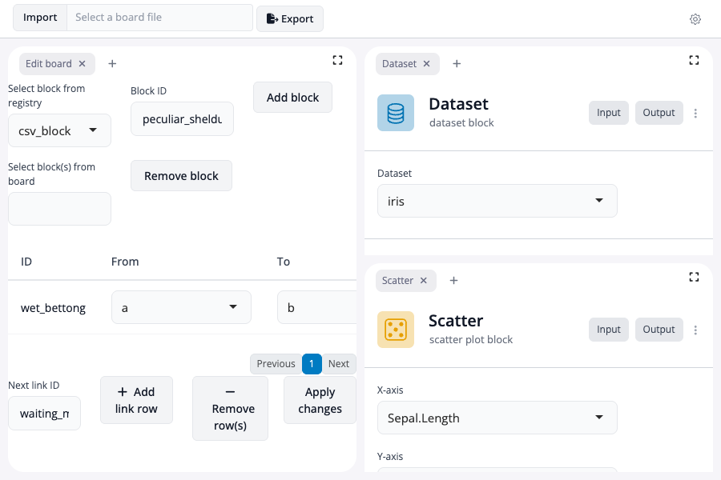

<!-- README.md is generated from README.Rmd. Please edit that file -->

```{r, include=FALSE}
knitr::opts_chunk$set(
  collapse = TRUE,
  comment = "#>",
  fig.path = "man/figures/README-",
  out.width = "100%"
)
```

# blockr.dock

<!-- badges: start -->
[](https://lifecycle.r-lib.org/articles/stages.html#experimental)
[](https://github.com/BristolMyersSquibb/blockr.dock/actions/workflows/ci.yaml)
[](https://app.codecov.io/gh/BristolMyersSquibb/blockr.dock)
<!-- badges: end -->

A docking layout manager provided by [dockViewR](https://github.com/DivadNojnarg/dockViewR) can be used as front-end to a [blockr](https://blockr.site/) board using this package.

## Installation

You can install the development version of blockr.dock from [GitHub](https://github.com/) with:

``` r
# install.packages("pak")
pak::pak("BristolMyersSquibb/blockr.dock")
```

## Simple dock

To start up a board for visualizing `Sepal.Length` against `Sepal.Width`
for the `iris` dataset:

```{r dock-code, code=readLines("inst/examples/dock/app.R"), eval=FALSE}
```

```{r dock-screenshot, echo=FALSE, eval=TRUE, message=FALSE, warning=FALSE, results='hide'}
webshot2::appshot(
  shiny::shinyAppDir(system.file("examples", "dock", package = "blockr.dock")),
  file = "man/figures/dock.png",
  delay = 3,
  vwidth = 900,
  vheight = 600
)
```



## Locked dock

A locked dock prevents users from adding or removing blocks and
extensions. Drag-and-drop and panel resizing are also disabled.

```{r locked-dock-code, code=readLines("inst/examples/locked-dock/app.R"), eval=FALSE}
```

```{r locked-dock-screenshot, echo=FALSE, eval=TRUE, message=FALSE, warning=FALSE, results='hide'}
webshot2::appshot(
  shiny::shinyAppDir(system.file("examples", "locked-dock", package = "blockr.dock")),
  file = "man/figures/locked-dock.png",
  delay = 3,
  vwidth = 900,
  vheight = 600
)
```


## Multi-view dock

Define multiple views (global tabs), each with its own DockView layout.
Blocks and extensions are shared across views via the board's DAG; view
membership is a layout concern only.

```{r views-code, code=readLines("inst/examples/views/app.R"), eval=FALSE}
```

```{r views-screenshot, echo=FALSE, eval=TRUE, message=FALSE, warning=FALSE, results='hide'}
# Use shinytest2 to click the view dropdown open before screenshotting
withr::local_envvar(NOT_CRAN = "true")
app <- shinytest2::AppDriver$new(
  system.file("examples", "views", package = "blockr.dock"),
  width = 900,
  height = 600
)
Sys.sleep(4)
app$run_js("document.querySelector('.blockr-view-toggle').click()")
Sys.sleep(0.5)
tmp <- tempfile(fileext = ".png")
app$get_screenshot(tmp)
file.copy(tmp, "man/figures/views.png", overwrite = TRUE)
app$stop()
```


