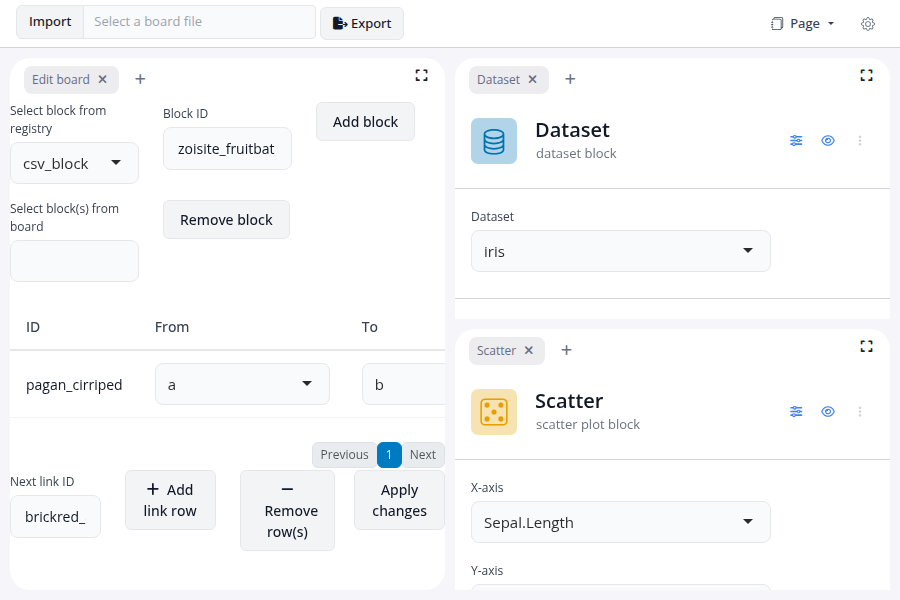
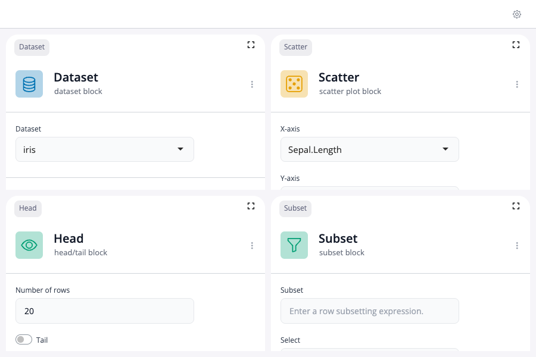
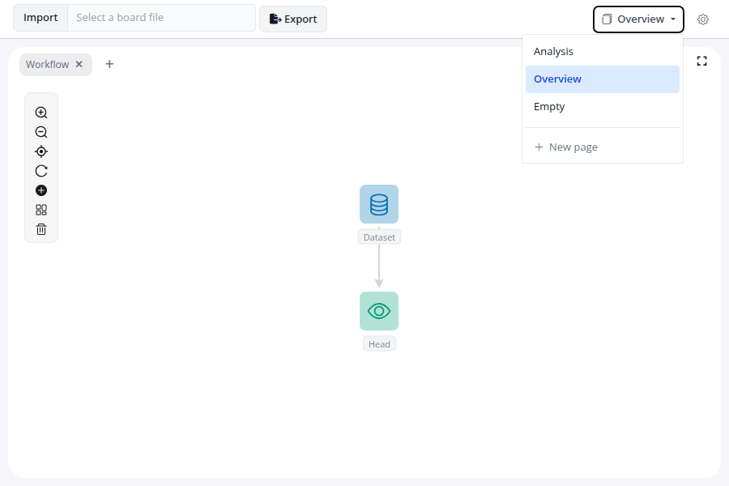

<!-- README.md is generated from README.Rmd. Please edit that file -->

# blockr.dock

<!-- badges: start -->

[](https://lifecycle.r-lib.org/articles/stages.html#experimental)
[](https://github.com/BristolMyersSquibb/blockr.dock/actions/workflows/ci.yaml)
[](https://app.codecov.io/gh/BristolMyersSquibb/blockr.dock)
[](https://CRAN.R-project.org/package=blockr.dock)
<!-- badges: end -->

A docking layout manager provided by
[dockViewR](https://github.com/DivadNojnarg/dockViewR) can be used as
front-end to a [blockr](https://blockr.site/) board using this package.

## Installation

You can install the development version of blockr.dock from
[GitHub](https://github.com/) with:

``` r
# install.packages("pak")
pak::pak("BristolMyersSquibb/blockr.dock")
```

## Simple dock

To start up a board for visualizing `Sepal.Length` against `Sepal.Width`
for the `iris` dataset:

``` r
library(blockr.dock)
library(blockr.core)

serve(
  new_dock_board(
    blocks = c(
      a = new_dataset_block("iris"),
      b = new_scatter_block(x = "Sepal.Length", y = "Sepal.Width")
    ),
    links = list(from = "a", to = "b", input = "data"),
    extensions = list(edit = new_edit_board_extension()),
    layouts = list("edit", list("a", "b"))
  )
)
```

<figure>

<figcaption aria-hidden="true">Simple dock</figcaption>
</figure>

## Locked dock

A locked dock prevents users from adding or removing blocks and
extensions. Drag-and-drop and panel resizing are also disabled.

``` r
library(blockr.dock)
library(blockr.core)

options(blockr.dock_is_locked = TRUE)

serve(
  new_dock_board(
    blocks = c(
      a = new_dataset_block("iris"),
      b = new_head_block(n = 20L),
      c = new_scatter_block(x = "Sepal.Length", y = "Sepal.Width"),
      d = new_subset_block()
    ),
    links = c(
      new_link("a", "b", input = "data"),
      new_link("b", "c", input = "data"),
      new_link("b", "d", input = "data")
    ),
    layouts = list(list("a", "b"), list("c", "d"))
  )
)
```

<figure>

<figcaption aria-hidden="true">Locked dock</figcaption>
</figure>

## Layouts

Since `blockr.dock` 0.1.1 every board carries a `dock_layouts` object: a
list of one or more views, exposed as a tab dropdown at the top of the
app. The single-page case (what rendered as a no-tab dock in 0.1.0) is
now a `dock_layouts` with one auto-named `"Page"` view, which is what
you see in the [Simple dock](#simple-dock) screenshot above.

To define multiple views explicitly, pass a `dock_layouts(...)` to
`layouts`. Each named entry becomes a tab; blocks and extensions are
shared across views via the board’s DAG, view membership is a layout
concern only.

``` r
library(blockr.core)
library(blockr.dock)

board <- new_dock_board(
  extensions = blockr.dag::new_dag_extension(),
  blocks = c(
    dataset_1 = new_dataset_block(),
    head_1 = new_head_block()
  ),
  links = new_link("dataset_1", "head_1"),
  layouts = dock_layouts(
    Analysis = list("dataset_1", "head_1", "dag_extension"),
    Overview = dock_grid("dag_extension", active = TRUE),
    Empty = list()
  )
)

serve(board, "my_board")
```

<figure>

<figcaption aria-hidden="true">Multi-view dock</figcaption>
</figure>

For the full set of shapes accepted by `new_dock_board(layouts = ...)`
(nested grids, tabbed panels, active-view selection, the coercion rules
that normalise everything to a `dock_layouts`), see
`vignette("layouts", package = "blockr.dock")`.
